# 无人值守ISO镜像制作与安装

## 实验目的

- 配置无人值守安装iso
  - 定制用户名和默认密码
  - 定制安装OenSSH Server
  - 安装过程禁止自动联网更新

## 实验环境

- ubuntu-18.04.4-server-amd64
- 虚拟机VMWare（Virtualbox对2K分辨率适配有问题，故选择使用VMWare）

## 实验过程

### 有人值守安装ubuntu server

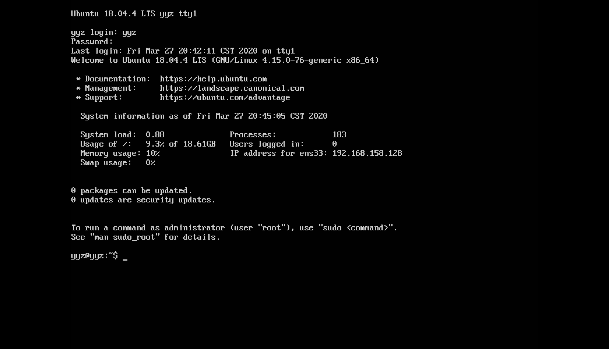

- 安装OpenSSH Server服务
- 禁止自动更新

### 配置网卡

配置双网卡

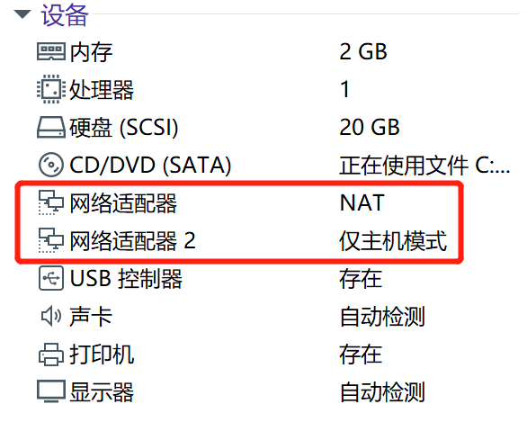

`ifconfig`查看网卡，启用双网卡

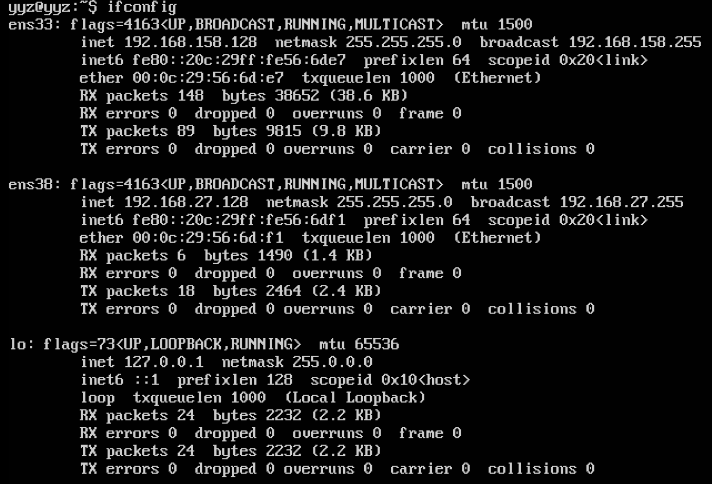

### 查看openssh-server，已安装

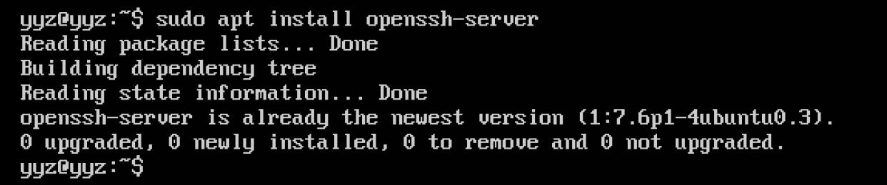

### 使用git-bash实现免密登录

生成密钥

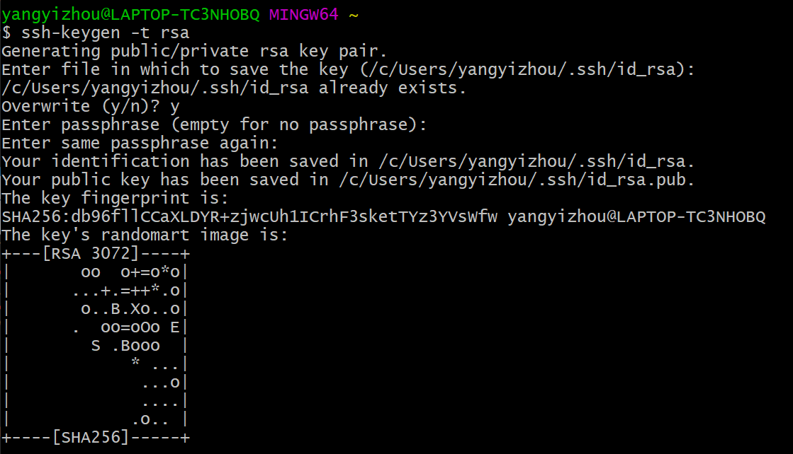

发送密钥到虚拟机

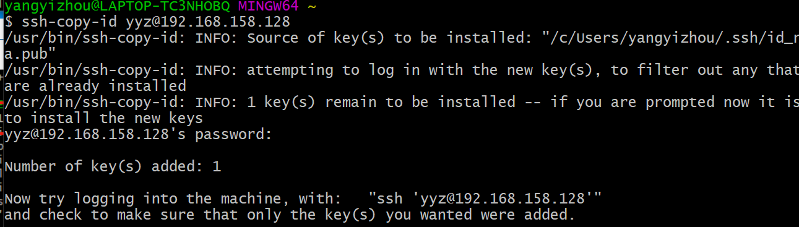

成功登入

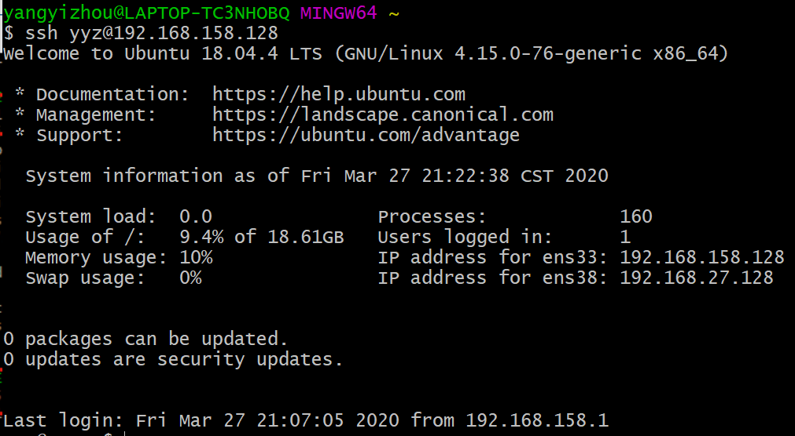

### 连接sftp服务

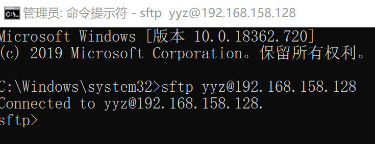

发送ISO文件到虚拟机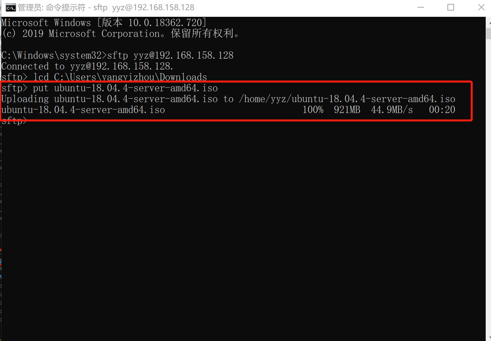

### 制作无人值守镜像

镜像挂载

```
# 在当前用户目录下创建一个用于挂载iso镜像文件的目录
mkdir loopdir

# 挂载iso镜像文件到该目录
sudo mount -o loop ubuntu-18.04.4-server-amd64.iso loopdir
# 创建一个工作目录用于克隆光盘内容
mkdir cd
 
# 同步光盘内容到目标工作目录
# 一定要注意loopdir后的这个/，cd后面不能有/
rsync -av loopdir/ cd

# 卸载iso镜像
umount loopdir

# 进入目标工作目录
cd cd/

# 编辑Ubuntu安装引导界面增加一个新菜单项入口
vim isolinux/txt.cfg
```

添加以下内容到该文件后强制保存退出

```
label autoinstall
  menu label ^Auto Install Ubuntu Server
  kernel /install/vmlinuz
  append  file=/cdrom/preseed/ubuntu-server-autoinstall.seed debian-installer/locale=en_US console-setup/layoutcode=us keyboard-configuration/layoutcode=us console-setup/ask_detect=false localechooser/translation/warn-light=true localechooser/translation/warn-severe=true initrd=/install/initrd.gz root=/dev/ram rw quiet
```

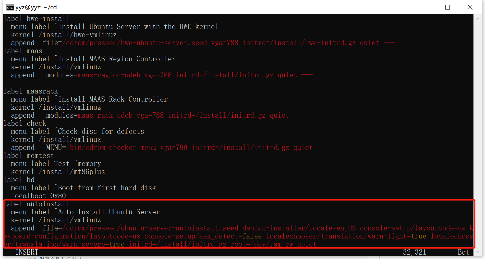

使用sftp将seed发送至虚拟机

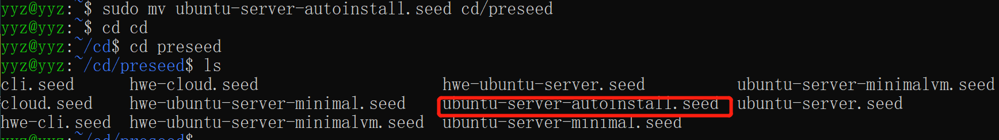

修改isolinux/isolinux.cfg，增加内容`timeout 10`

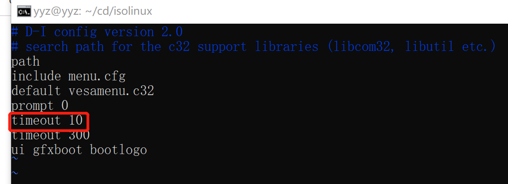

生成iso

```
# 重新生成md5sum.txt
cd ~/cd && find . -type f -print0 | xargs -0 md5sum > md5sum.txt

# 封闭改动后的目录到.iso
IMAGE=custom.iso
BUILD=~/cd/

mkisofs -r -V "Custom Ubuntu Install CD" \
            -cache-inodes \
            -J -l -b isolinux/isolinux.bin \
            -c isolinux/boot.cat -no-emul-boot \
            -boot-load-size 4 -boot-info-table \
            -o custom.iso .

# 如果目标磁盘之前有数据，则在安装过程中会在分区检测环节出现人机交互对话框需要人工选择
```

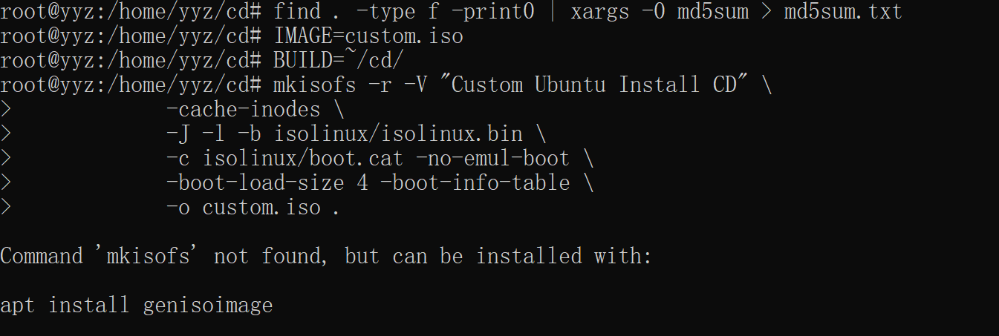

提示安装genisoimage包

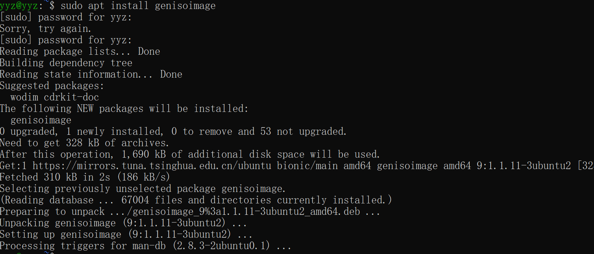

镜像生成成功

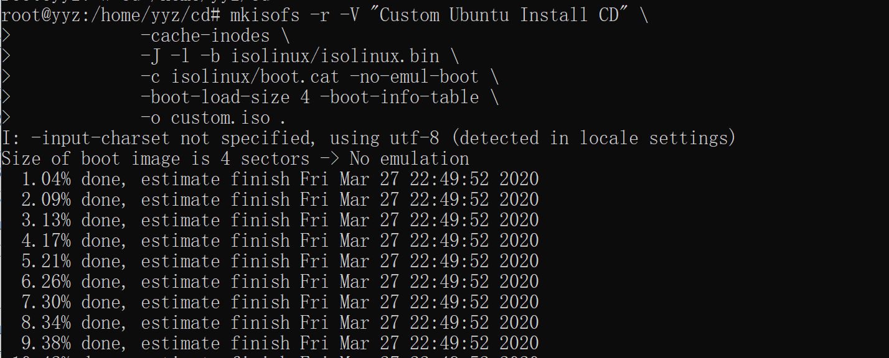

将镜像从虚拟机取回物理机

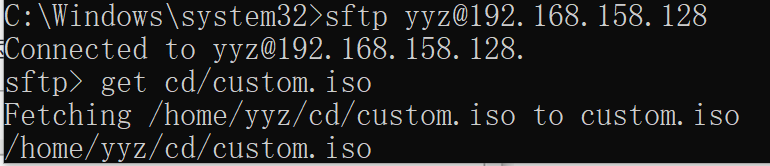

无人值守安装成功


定制化用户名密码登入成功


## 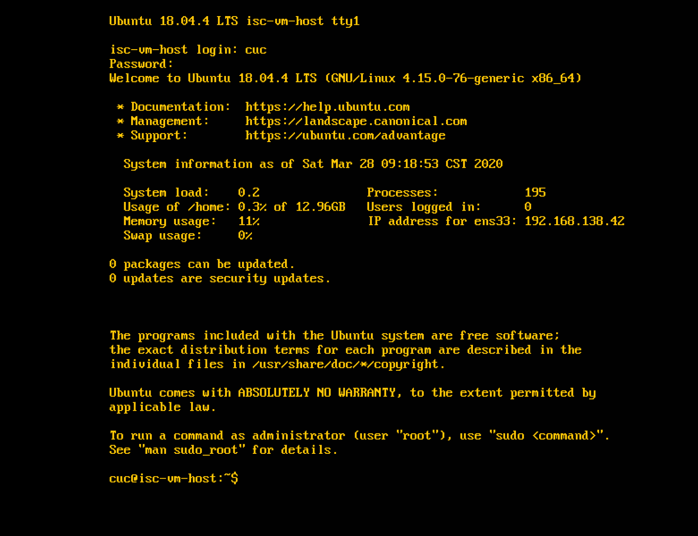

## 无人值守镜像安装过程


## 遇到的问题

1.使用sftp服务提示被拒绝访问。

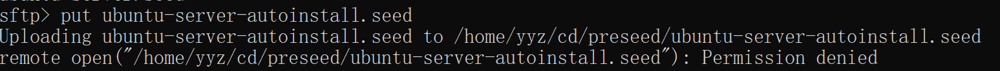

解决方法：多次尝试发现只能传输至/home/yyz目录下，于是先传输至/yyz目录下，在开启root权限mv至/preseed目录下，没有尝试登入root用户后使用sftp服务直接发送到/preseed目录下，但应该可行。

2.同样是拒绝访问，开启root用户后解决。


3.因为第一次下载速度过慢，使用crtl+c无法终止下载，使用crtl+z终止下载，更新源后，发现无法使用apt-get，提示被锁定。

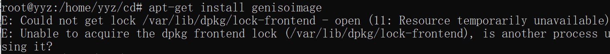

解决办法：应该是之前的线程没有结束，但我查看进程只有一个显示apt，Kill该进程后，依然显示锁定，于是直接重启解决问题。

4.第一次制作的镜像过程没有问题，但在安装过程中没有自动安装

解决方法：询问同学，是需要将label autoinstall放在前面。

5.已经在isolinux.cfg文件中修改等待时间，但镜像安装过程等待还是30s。

还没找到原因，未解决。